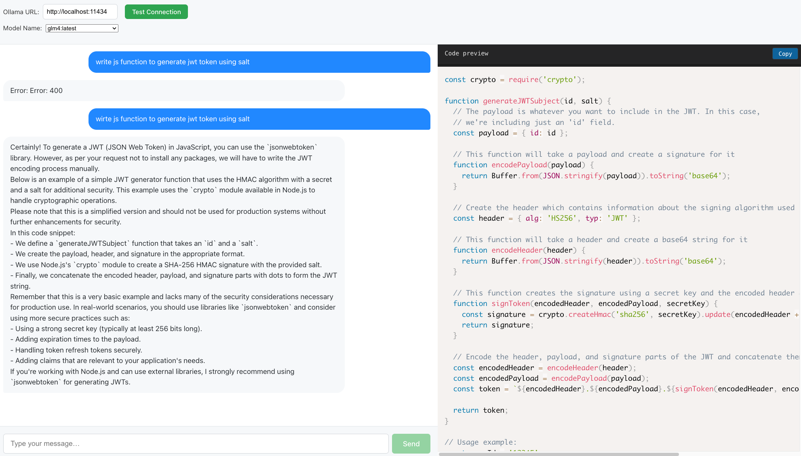

GLM-4 Code Generator (React + Ollama)
A React app that generates syntax-highlighted code using the GLM-4 model via Ollama.

🚀 Setup
1. Install Ollama
bash
curl -fsSL https://ollama.ai/install.sh | sh  # Linux/macOS
winget install ollama.ollama                 # Windows (PowerShell)
2. Download GLM-4
bash
ollama pull glm4
3. Run Ollama (keep this running)
bash
ollama serve
4. Set Up React App
bash
git clone https://github.com/32xnabin/ai-code-generator.git
cd your-repo
npm install
npm start
App will open at http://localhost:5173
to a test connection
choose glm4 model or others if you want 
start using 

🔧 Troubleshooting
Ollama issues? Run ollama list to verify GLM-4 is downloaded.

Connection problems? Ensure Ollama's API URL matches your app config (default: http://localhost:11434).

Syntax highlighting? Check if prismjs is installed and language classes (e.g., language-js) are applied.

📜 License
MIT

